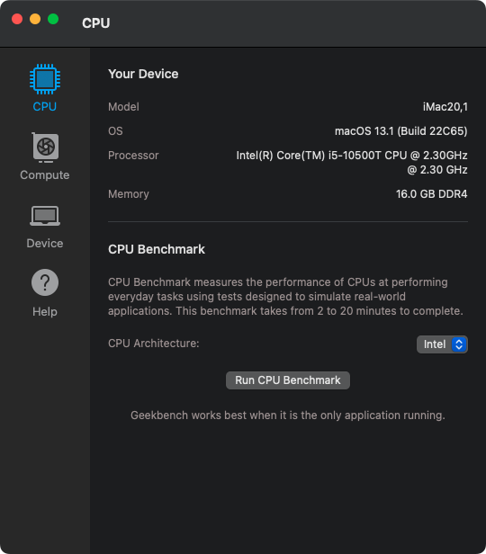
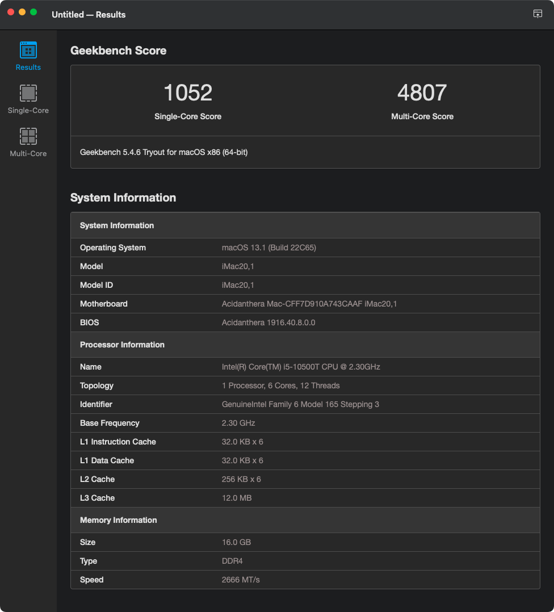

## Dell OptiPlex 3080 Micro (3080MFF) Hackintosh OpenCore EFI


### [简体中文](README.zh_CN.md)

### Perfectly tested on

> When using Intel wireless network card, you need to select the corresponding `config.intel.wireless.*** .plist` according to the system version, and rename it to `config.plist`.

- macOS Monterey 12.x
- macOS Ventura 13.x
- macOS Sonoma 14.x


### OpenCore

[OpenCore 1.0.2](https://github.com/acidanthera/OpenCorePkg)


### Spec

- BIOS: 2.16.0
- Chipset: DELL B460
- CPU: Intel 10th i5-10500T
- Memo: SK hynix 16GB(2x8GB) DDR4 3200 Mhz
- iGPU: Intel UHD Graphic 630
- HDA: Realtek ALC3246(ALC256)
- SSD: Kioxia 512G (KBG40ZNS) m.2 2230
- LAN: Realtek RTL8111HSD-CG
- WLAN: BCM94360CS2
- PSU: DELL 65w


### BIOS

```
System Configuration
  |-- SATA Operaition: AHCI

Video
  |-- Primary Display: Intel HD Graphics

Security
  |-- PTT Security/PTT On: Disabled

Secure Boot
  |-- Secure Boot Enable: Disabled

PSecure Boot
  |-- Secure Boot Mode: Audit Mode

Intel Software Guard Extensions
  |-- Intel SGX Enable: Disabled

PowerManagement
  |-- Deep Sleep Control: Disabled
  |-- USB Wake Support:   Disabled
  |-- Wake on LAN/WLAN:   Lan only
  |-- Block Sleep:        YES

POST Behavior
  |-- Fastboot: Minimal

```


### Notice

- Use [OpenCore Configurator](https://mackie100projects.altervista.org/opencore-configurator/) build your own SMBIOS 
- Use [RU.efi](RU.efi) Unlock `CFG LOCK` , Change `DVMT = 64MB` 

Option   | UEFI Variable Name | Address | Default | Replace
---------|--------------------|---------|---------|---------
CFG LOCK | CPUSetup           | 0x3E    | 0x1     | 0x0
DVMT     | SaSetup            | 0xF5    | 0x0     | 0x2

- Unlock `CFG LOCK`  

 

- Change `DVMT` to `64MB` 

 


### Screenshot







### Kexts

- [Lilu.kext](https://github.com/acidanthera/Lilu)
- [SMCProcessor.kext](https://github.com/acidanthera/VirtualSMC)
- [SMCSuperIO.kext](https://github.com/acidanthera/VirtualSMC)
- [SMCDellSensors.kext](https://github.com/acidanthera/VirtualSMC)
- [VirtualSMC.kext](https://github.com/acidanthera/VirtualSMC)
- [WhateverGreen.kext](https://github.com/acidanthera/WhateverGreen)
- [AppleALC.kext](https://github.com/acidanthera/AppleALC)
- [RealtekRTL8111.kext](https://github.com/Mieze/RTL8111_driver_for_OS_X)
- [AirportItlwm.kext](https://github.com/OpenIntelWireless/itlwm)
- [IntelBluetoothFirmware.kext](https://github.com/OpenIntelWireless/IntelBluetoothFirmware)
- [BlueToolFixup.kext](https://github.com/acidanthera/BrcmPatchRAM)


### Tools

- [Hackintool](https://github.com/headkaze/Hackintool) 
- [OCAuxiliaryTools](https://github.com/ic005k/OCAuxiliaryTools) AKA `OCAT`.
- [OpenCore Configurator](https://mackie100projects.altervista.org/opencore-configurator/) AKA `OCC`.
- [GenSMBIOS](https://github.com/corpnewt/GenSMBIOS) Generate SMBIOS.
- [MountEFI](https://github.com/corpnewt/MountEFI) Mount EFI partition.
- [EFI Agent](https://github.com/headkaze/EFI-Agent) Better EFI partition mount App.
- [gibMacOS](https://github.com/corpnewt/gibMacOS) Build your own MacOS image.
- [ProperTree](https://github.com/corpnewt/ProperTree) Plist editor.


### OC Theme

[BsxM1](https://github.com/blackosx/BsxM1)
