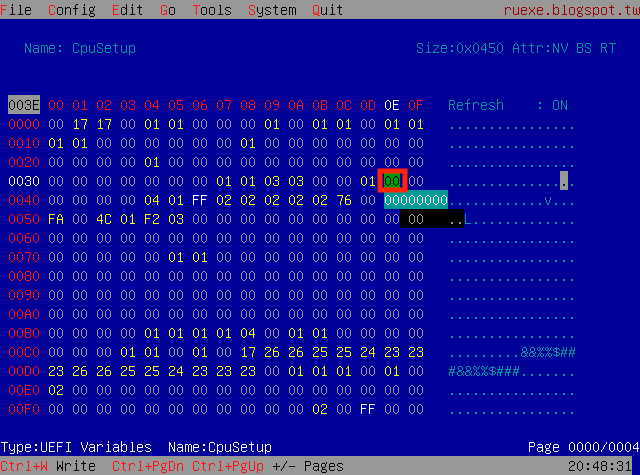
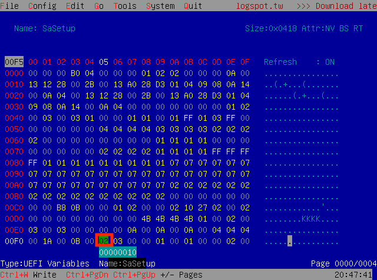
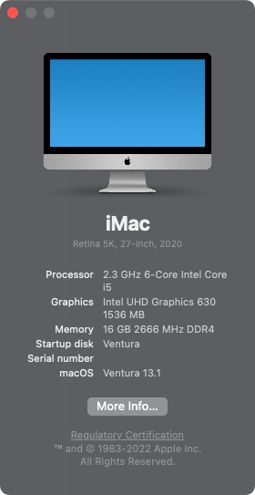
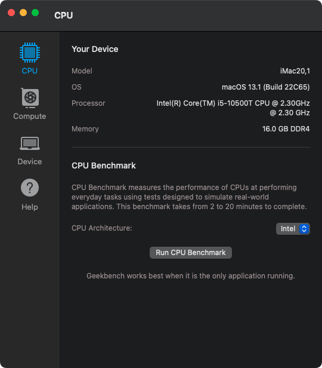
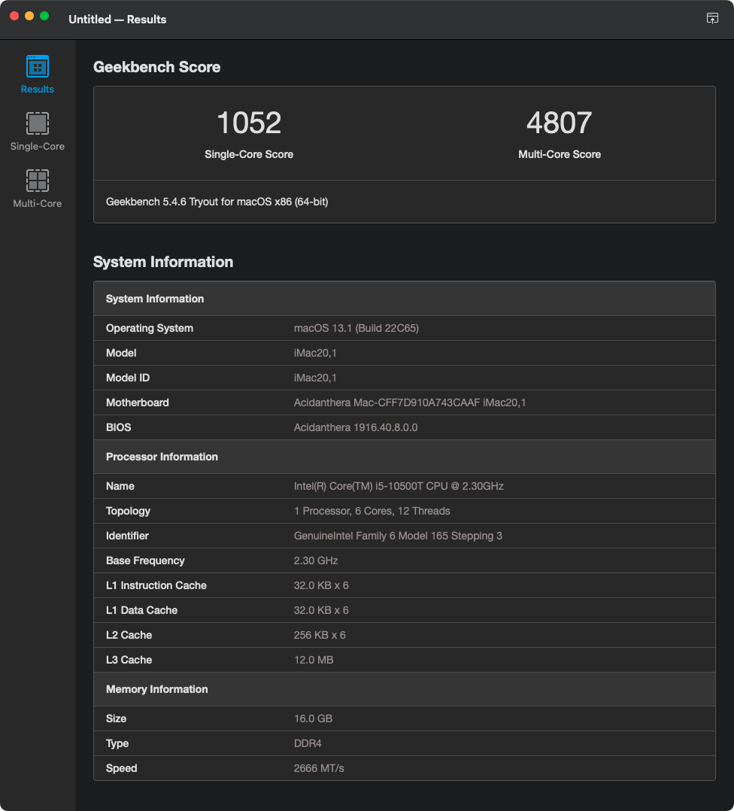

## Dell OptiPlex 3080 Micro (3080MFF) 黑苹果 OpenCore EFI


### [English](README.md)

### 可完美运行

> 使用 Intel 无线网卡时需要根据系统版本在 `config.plist`中启用对应的 `AirportItlwm.kext` 驱动

- macOS Monterey 12.x
- macOS Ventura 13.x


### OpenCore

[OpenCore 0.9.4](https://github.com/acidanthera/OpenCorePkg)


### 机器配置

- BIOS: 2.16.0
- 主板: 戴尔 B460
- 处理器: Intel 10代 i5-10500T
- 内存: 海力士 16GB(2x8GB) DDR4 3200 Mhz
- 显卡: 英特尔® 超核芯显卡 630
- 声卡: Realtek ALC3246(ALC256)
- 硬盘: 铠侠 Kioxia 512G (KBG40ZNS) m.2 2230
- 网卡: Realtek RTL8111HSD-CG
- 无线: BCM94360CS2（白果拆机卡）/ Intel(R) Dual Band Wireless AC 3165
- 电源: 戴尔 65W


### BIOS设置

```
System Configuration
  |-- SATA Operaition: AHCI

Video
  |-- Primary Display: Intel HD Graphics

Security
  |-- PTT Security/PTT On: Disabled

Secure Boot
  |-- Secure Boot Enable: Disabled

PSecure Boot
  |-- Secure Boot Mode: Audit Mode

Intel Software Guard Extensions
  |-- Intel SGX Enable: Disabled

PowerManagement
  |-- Deep Sleep Control: Disabled
  |-- USB Wake Support:   Disabled
  |-- Wake on LAN/WLAN:   Lan only
  |-- Block Sleep:        YES

POST Behavior
  |-- Fastboot: Minimal

Virtualization Support
  |-- VT For Direct I/O: Disabled
```


### 注意

- 使用 [OpenCore Configurator](https://mackie100projects.altervista.org/opencore-configurator/) 替换三码 
- 使用 [RU.efi](RU.efi) 解锁 `CFG LOCK` , 并修改核显参数 `DVMT = 64MB` 

Option   | UEFI Variable Name | Address | Default | Replace
---------|--------------------|---------|---------|---------
CFG LOCK | CPUSetup           | 0x3E    | 0x1     | 0x0
DVMT     | SaSetup            | 0xF5    | 0x0     | 0x2

- 解锁 `CFG LOCK`  

 

- 修改 `DVMT` 为 `64MB`  

 


### 系统截图








### Kexts

- [Lilu.kext 1.6.7](https://github.com/acidanthera/Lilu)

- [SMCProcessor.kext 1.3.2](https://github.com/acidanthera/VirtualSMC)

- [SMCSuperIO.kext 1.3.2](https://github.com/acidanthera/VirtualSMC)

- [SMCDellSensors.kext 1.3.2](https://github.com/acidanthera/VirtualSMC)

- [VirtualSMC.kext 1.3.2](https://github.com/acidanthera/VirtualSMC)

- [WhateverGreen.kext 1.6.6](https://github.com/acidanthera/WhateverGreen)

- [AppleALC.kext 1.8.4](https://github.com/acidanthera/AppleALC)

- [RealtekRTL8111.kext 2.4.2](https://github.com/Mieze/RTL8111_driver_for_OS_X)

- [AirportItlwm.kext 2.2.0](https://github.com/OpenIntelWireless/itlwm)

- [IntelBluetoothFirmware.kext 2.3.0](https://github.com/OpenIntelWireless/IntelBluetoothFirmware)

- [BlueToolFixup.kext 2.6.8](https://github.com/acidanthera/BrcmPatchRAM)

  


### 工具

- [Hackintool](https://github.com/headkaze/Hackintool) 
- [OCAuxiliaryTools](https://github.com/ic005k/OCAuxiliaryTools) 即 `OCAT`.
- [OpenCore Configurator](https://mackie100projects.altervista.org/opencore-configurator/) 即 `OCC`。
- [GenSMBIOS](https://github.com/corpnewt/GenSMBIOS) 三码生成工具。
- [MountEFI](https://github.com/corpnewt/MountEFI) EFI 分区挂载工具。
- [EFI Agent](https://github.com/headkaze/EFI-Agent) 更方便的EFI分区挂载工具。
- [gibMacOS](https://github.com/corpnewt/gibMacOS) macOS 官方镜像下载工具。
- [ProperTree](https://github.com/corpnewt/ProperTree) Plist 编辑器。
